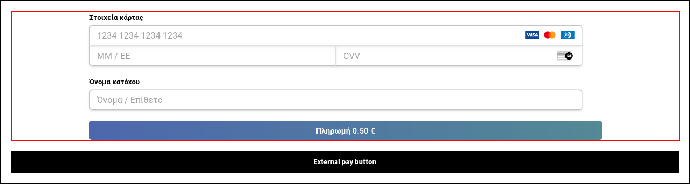

# Everypay Issues

This is a mini app to replicate issues with the implementation of [payform](https://docs.everypay.gr/accept-payments/payform). You can run the app locally or use the deployment on [netlify](https://everypay-issues.netlify.app).

## 1. Form inputs width

When using the `default` or `barebone` themes, the form inputs are wrapped inside a div that results in broken form inputs width.

```html
<form>
  <div class="MuiGrid-root MuiGrid-container">
    <div> <!-- This container causes the issue -->
      <!-- Form inputs -->
    </div>
  </div>
</form>
```

| Default | Barebone | Material |
| ------- | -------- | -------- |
|  |  |  |

#### Proposed Fix

To fix this issue add `flex-grow: 1` or `width: 100%` to the `form > .MuiGrid-root > div` element.

## 2. Form width depends on media query

The form container uses the `fixed` prop from the `MuiContainer` component. This is not suitable for non full window width implementations as it uses media queries to set the max-width of the container. From the [mui docs](https://mui.com/material-ui/react-container/#fixed):

> If you prefer to design for a fixed set of sizes instead of trying to accommodate a fully fluid viewport, you can set the fixed prop. The max-width matches the **min-width** of the **current breakpoint**.

**Notice:** The current breakpoint is the iframe width, not the window width where the iframe is used.

```css
@media (min-width: 1280px) {
  .MuiContainer-fixed {
    max-width: 1280px;
  }
}
@media (min-width: 960px) {
  .MuiContainer-fixed {
    max-width: 960px;
  }
}
@media (min-width: 600px) {
  .MuiContainer-fixed {
    max-width: 600px;
  }
}
```

When using the `fixed` prop with the mui component, if your iframe container has a width >= 1280px, the form will be 1280px, if the iframe is >= 960px, the form will be 960px etc. This results in unpredictable form sizes.

| 1280px iframe | 960px iframe | 600px iframe |
| ------------- | ------------ | ------------ |
|  |  |  |

#### Proposed Fix

Remove the fixed prop from the `MuiContainer` component. If this is a breaking change then a boolean `fixedSize` option can be introduced in the [payform options](https://docs.everypay.gr/#formoptions-parameters) to toggle the container prop.

Another solution is to support the value `full` in the `size` payform option, that will make the form to fill the available iframe width.

### 3. Form height when button and/or errors disabled

If the form button is disabled with `display.button: false`, there is a gap below the form. This is because only the button is removed and not the button container that has a margin-top: 20px style.

| Button disabled | Errors disabled | Both disabled |
| --------------- | --------------- | ------------- |
|  |  |  |

#### Proposed Fix

When the button is disabled also hide it's container. When changing the form height, check if errors are enabled.

### 4. Error and validation callbacks not working

Error and validation callbacks are needed if you disable the form error messages with `display.errors: false` and want to show errors in an external element.

Also validation callbacks are needed if you use an external pay button, so the button can be initially disabled and become enabled after the form is valid.

| 1 error | 2 errors | 3 errors |
| ------- | -------- | -------- |
|  |  |  |

## Development

Make sure to install the dependencies:

```bash
yarn install
```

Start the development server on `http://localhost:3000`:

```bash
yarn dev
```
